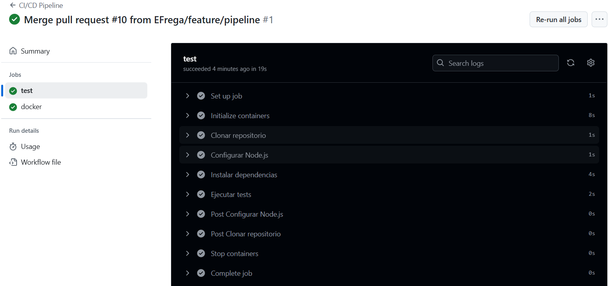
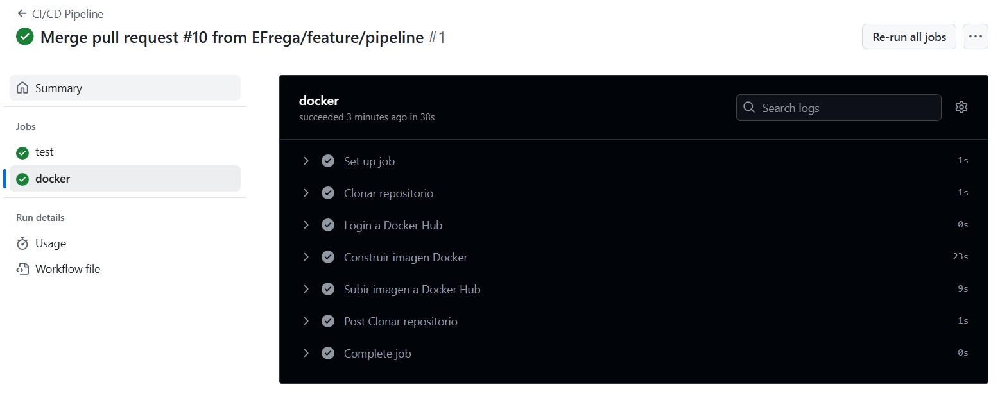
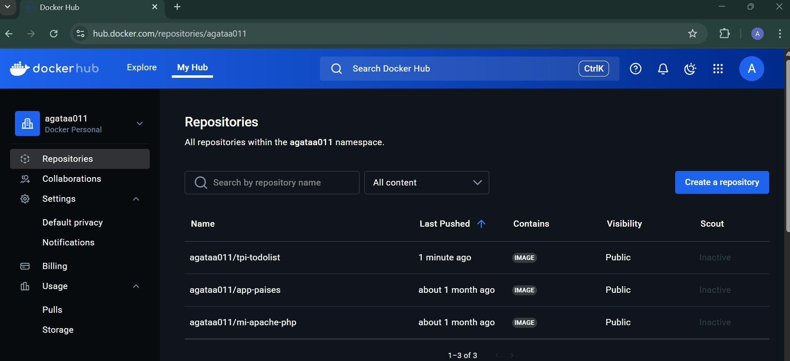

# 📝 TPI DevOps - ToDo List App

Aplicación desarrollada como Trabajo Práctico Integrador (TPI) para aplicar prácticas de DevOps: desarrollo, contenerización, testing y despliegue continuo.

---

## 🚀 Descripción

Se trata de una API REST sencilla para gestionar tareas (to-do list), desarrollada en *Node.js, con persistencia en **MongoDB, y con integración CI/CD mediante **GitHub Actions* y *Docker Hub*.

---

## 🛠️ Tecnologías utilizadas

•⁠  ⁠Node.js (Express)
•⁠  ⁠MongoDB (vía Mongoose)
•⁠  ⁠Docker y Docker Compose
•⁠  ⁠GitHub Actions (CI/CD)
•⁠  ⁠Jest + Supertest (testing)
•⁠  ⁠Docker Hub (almacenamiento de imágenes)

---

## Instrucciones para correr localmente este proyecto con Docker

•⁠  ⁠Clona el repositorio a tu entorno local usando la terminal y el comando:
⁠ bash
git clone https://github.com/EFrega/TPI_Devops.git
 ⁠
•⁠  ⁠Asegurate de tener Docker desktop instalado y ejecutandose
•⁠  ⁠Asegurate de contar con al menos 500mb de espacio en disco
•⁠  ⁠Abre una terminal y una vez en el directorio raiz del proyecto ejecuta:
⁠ bash
docker compose --build
 ⁠

•⁠  ⁠Luego abre otra terminal también  en el directorio raiz del proyecto y ejecuta: 
⁠ bash
cd frontend-todolist
npm install
npm start
 ⁠

## 🧪 Testing

Los tests están automatizados con *Jest* y *Supertest*.

•⁠  ⁠Si ejecutas el proyecto en forma local sin utilizar Docker, puedes ejecutar las pruebas con:
⁠ bash
npm install
npm test
 ⁠

•⁠  ⁠En CI, se conectan automáticamente a un contenedor MongoDB usando:
⁠ bash
MONGO_URL="mongodb://127.0.0.1:27017/todolist" npm test
 ⁠

---

## 📦 Estructura del Proyecto

tpi-todolist/ 
├── src/ 
│ └── app.js 
├── tests/ 
│ └── api.test.js 
├── .github/ 
│ └── workflows/ 
│ └── ci.yml 
├── Dockerfile 
├── docker-compose.yml 
├── package.json 
├── .env 
├── frontend-todolist/ 
│ └── src/ 
│      └── App.js/ 
│      └── index.js/ 
└── README.md 

## 🐳 Dockerización

Build de la imagen:

⁠ bash
docker build -t tpi-todolist .
 ⁠

Correr con Docker Compose:

⁠ bash
docker-compose up --build
 ⁠

La app estará disponible en:

📍 http://localhost:3000/tasks

## 🔁 CI/CD

Cada push a la rama main ejecuta:

•⁠  ⁠Instalación de dependencias
•⁠  ⁠Pruebas automatizadas
•⁠  ⁠Construcción de imagen Docker
•⁠  ⁠Push automático a Docker Hub

## 🔗 Docker Hub:

https://hub.docker.com/repository/docker/agataa011/tpi-todolist/general

## 📸 Capturas del pipeline:

✅ Tests ejecutándose:

✅ Creación de Imagen en DockerHub:

🐳 Imagen subida a Docker Hub:

## ☁️ Despliegue

(✳️ Opcional) Puede desplegarse en servicios como:

•⁠  ⁠Render.com
•⁠  ⁠Railway.app
•⁠  ⁠Heroku

# 👥 Roles del equipo

•⁠  ⁠Desarrollo backend: [Adrian Agata]
•⁠  ⁠Desarrollo frontend: [Ezequiel Frega]
•⁠  ⁠Desarrollo Testing & QA: [Trinidad Pasi]
•⁠  ⁠CI/CD: [Alejandro Loredo]
•⁠  ⁠Dockerización: [Ricardo Gieco]

## ✅ Conclusiones

Este proyecto permitió aplicar conceptos claves de DevOps en un entorno práctico, incluyendo automatización de pruebas, integración continua, y contenerización con Docker.

Se logró un entorno reproducible, escalable y fácilmente desplegable.

## 📄 Licencia
Uso académico – Tecnicatura en Desarrollo de Software